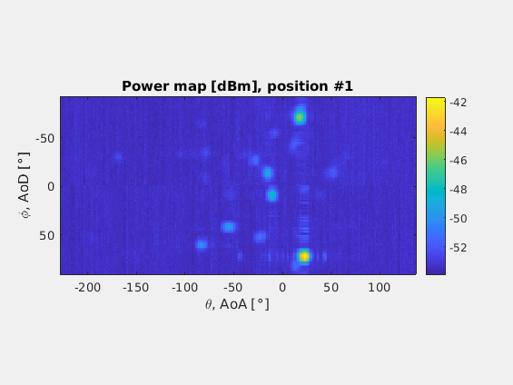
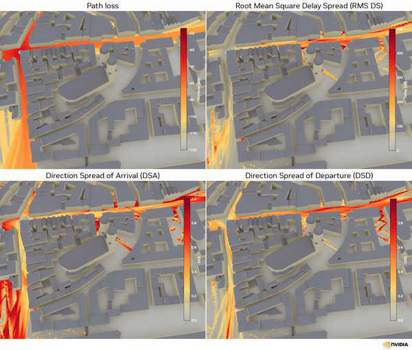

this is the python script repository for data processing of https://ieee-dataport.org/open-access/millimeter-wave-radio-slam-60-ghz-indoor-sensing-dataset

The filed is started in the communication community and the idea is to reconstruct the geometric environment out of multipath signals. 
- 

- 

- 
